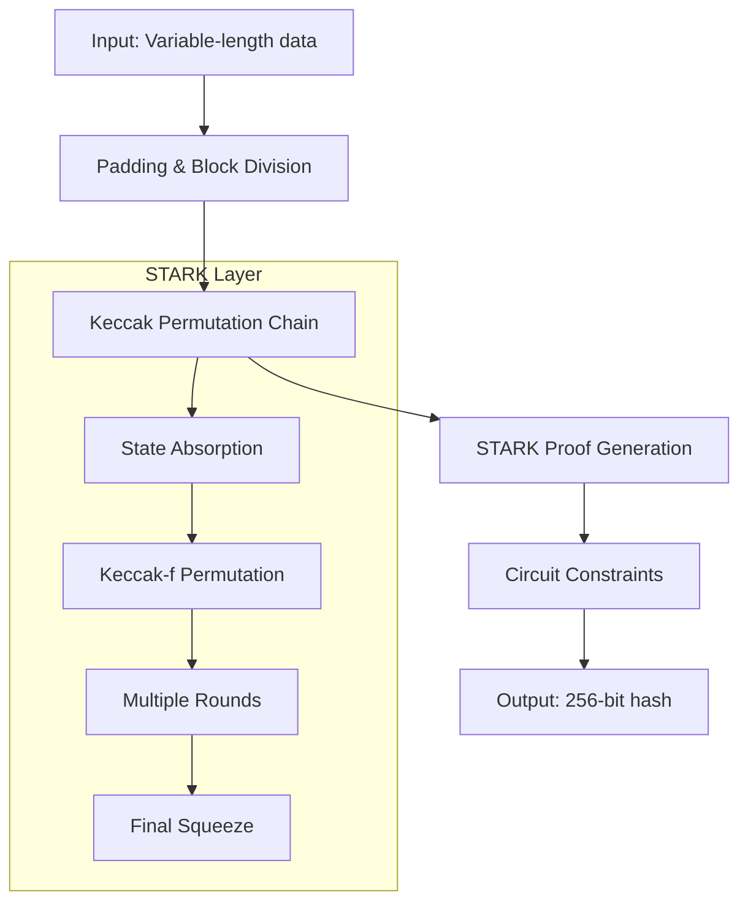
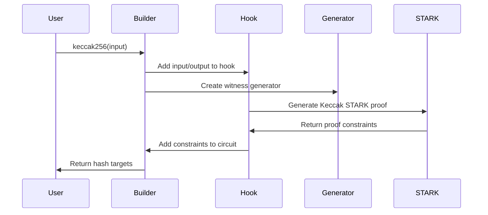

# plonky2_keccak


STARK-based Keccak256 hash function implementation for Plonky2.

## Overview

This library provides a circuit gadget for Plonky2 that computes Keccak256 hashes compliant with Solidity's specification. It uses STARK proofs to efficiently verify multiple Keccak256 permutations in a single proof.

## Features

- Solidity-compatible Keccak256 implementation
- STARK-based proof generation for hash operations
- Batch processing of multiple hash computations
- Integration with Plonky2 circuit builders
- Big-endian input/output format matching Solidity

## Architecture

### Structure

The library is organized into several modules:

- `builder.rs` - Plonky2 circuit builder extensions for Keccak256
- `hook.rs` - Integration hooks for STARK proof generation
- `keccak_stark/` - STARK implementation for Keccak256 permutations
- `generators/` - Witness and proof generators
- `utils.rs` - Keccak256 utility functions and reference implementation
- `circuit_utils.rs` - Circuit-specific utilities

### Core Components

#### BuilderKeccak256 Trait

Extends Plonky2's CircuitBuilder with Keccak256 functionality:

```rust
pub trait BuilderKeccak256<F: RichField + Extendable<D>, const D: usize> {
    fn keccak256<C: GenericConfig<D, F = F> + 'static>(
        &mut self,
        input: &[U32Target],
    ) -> [U32Target; 8];
}
```

#### KeccakHook

Manages the integration between circuit building and STARK proof generation:

```rust
pub struct KeccakHook<F, C, const D: usize> {
    inputs: Vec<Vec<U32Target>>,   // Input data for each hash
    outputs: Vec<[U32Target; 8]>,  // Output hashes
}
```

#### U32Target

Type alias for Plonky2 targets representing 32-bit values:

```rust
pub type U32Target = Target;
```

## Processing Flow

### Keccak256 Computation Workflow



### Circuit Building Process



## Usage Examples

### Basic Keccak256 Hash

```rust
use plonky2::plonk::{circuit_builder::CircuitBuilder, circuit_data::CircuitConfig};
use plonky2_keccak::builder::BuilderKeccak256;

let mut builder = CircuitBuilder::<F, D>::new(CircuitConfig::default());

// Create input targets (each representing a 32-bit word)
let input_targets: Vec<Target> = (0..10)
    .map(|_| builder.add_virtual_target())
    .collect();

// Compute Keccak256 hash
let hash_output = builder.keccak256::<C>(&input_targets);

// hash_output is [Target; 8] representing the 256-bit hash as 8 x 32-bit words
```

### Multiple Hash Computations

```rust
use plonky2_keccak::builder::BuilderKeccak256;

let mut builder = CircuitBuilder::<F, D>::new(CircuitConfig::default());

// Compute multiple hashes in the same circuit
let inputs = vec![
    (0..5).map(|_| builder.add_virtual_target()).collect::<Vec<_>>(),
    (0..8).map(|_| builder.add_virtual_target()).collect::<Vec<_>>(),
    (0..12).map(|_| builder.add_virtual_target()).collect::<Vec<_>>(),
];

let hashes: Vec<[Target; 8]> = inputs
    .iter()
    .map(|input| builder.keccak256::<C>(input))
    .collect();
```

### Setting Witness Values

```rust
use plonky2::iop::witness::{PartialWitness, WitnessWrite};
use plonky2_keccak::utils::solidity_keccak256;

// Compute expected hash using reference implementation
let input_data = vec![0x12345678u32, 0x9abcdef0u32, 0x11111111u32];
let expected_hash = solidity_keccak256(&input_data);

// Set witness values
let mut pw = PartialWitness::new();
for (target, &value) in input_targets.iter().zip(input_data.iter()) {
    pw.set_target(*target, F::from_canonical_u32(value));
}
for (target, &value) in hash_output.iter().zip(expected_hash.iter()) {
    pw.set_target(*target, F::from_canonical_u32(value));
}

// Build and prove circuit
let circuit = builder.build::<C>();
let proof = circuit.prove(pw).unwrap();
```

### Block Processing

- **Block Size**: 136 bytes (34 x 32-bit words) per Keccak block
- **Padding**: Automatic padding following Keccak specification
- **State Management**: 1600-bit state represented as 50 x 32-bit words
- **Permutation**: 24 rounds of Keccak-f transformation

## Dependencies

- **plonky2**: Core proving system and circuit builder
- **starky**: STARK proof system implementation
- **tiny-keccak**: Reference Keccak implementation for verification

## Features

- `not-constrain-keccak`: Disables STARK constraint generation for testing

## Testing

Run tests with:

```bash
cargo test -r
```

The test suite includes:

- Solidity compatibility verification
- Multiple input length testing
- STARK proof generation and verification
- Circuit building and proving

## Important Notes

### Input Constraints

When using the `keccak256` function, you must ensure that each input target is properly constrained to 32 bits:

```rust
// Add range checks for input values
for &input_target in input_targets.iter() {
    builder.range_check(input_target, 32);
}
```

### Endianness

- **Input**: Big-endian 32-bit words (matching Solidity)
- **Output**: Big-endian 32-bit words (8 words = 256 bits)
- **Internal Processing**: Little-endian for Keccak-f compatibility

## License

This project is licensed under the [MIT License](LICENSE).
